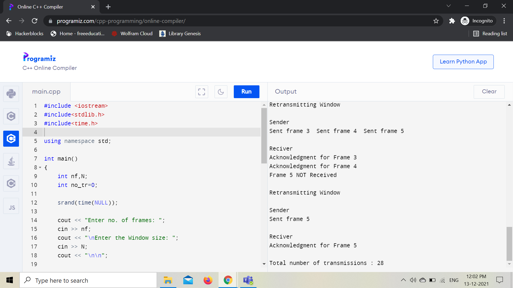
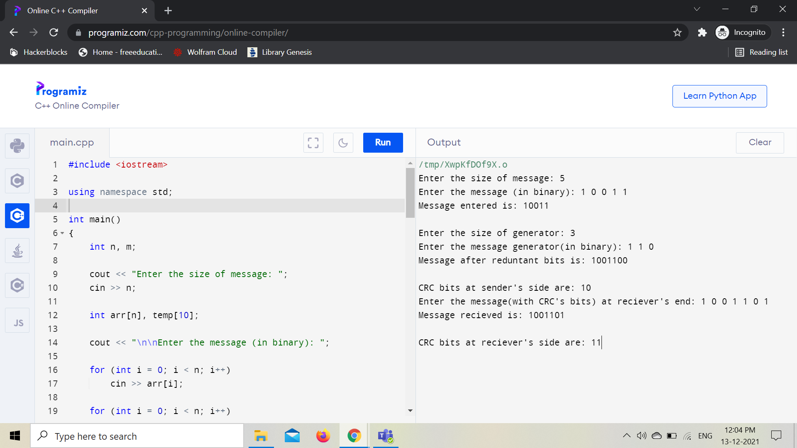

# Computer Networks Practical
There are some practical code implementation regarding computer networks !!!
### Q1) Go back n sliding window protocol
Go-Back-N ARQ is a specific instance of the automatic repeat request (ARQ) protocol, in which the sending process
continues to send a number of frames specified by a window size even without receiving an acknowledgement (ACK)
packet from the receiver. It is a special case of the general sliding window protocol with the transmit window size
of N and receive window size of 1. It can transmit N frames to the peer before requiring an ACK.
#### Output

### Q2) Cyclic Redundancy Check (CRC) error detection algorithm for noisy channel
A cyclic redundancy check is an error-detecting code commonly used in digital networks and storage devices to
detect accidental changes to raw data. Blocks of data entering these systems get a short check value attached,
based on the remainder of a polynomial division of their contents.  On retrieval, the calculation is repeated and,
in the event the check values do not match, corrective action can be taken against data corruption. CRCs can be
used for error correction too.
#### Output

